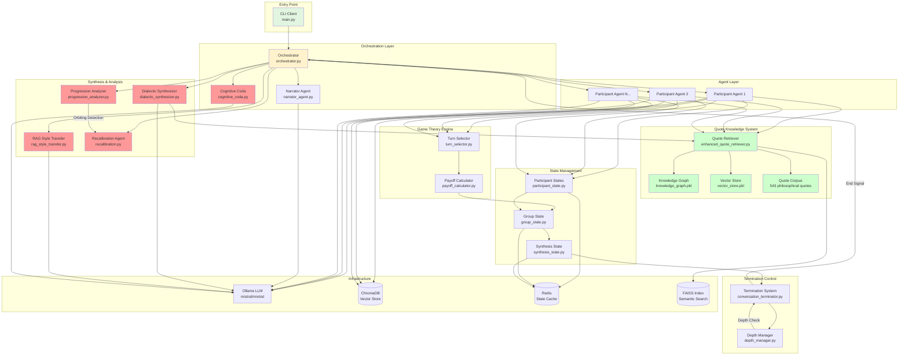
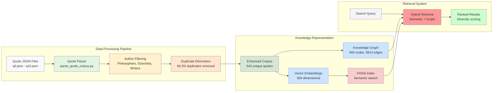
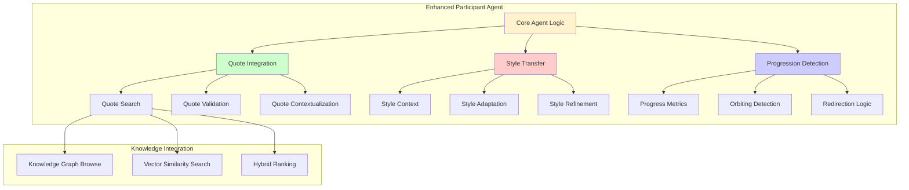

# AI Talks: Advanced Multi-Agent Philosophical Discussion System

An AI-powered system that orchestrates rich philosophical discussions using game theory, dialectic synthesis, and intelligent quote integration with emergent social dynamics.

## 🌟 Latest Features (Phase 6A)

- **🧠 Dialectic Synthesizer**: Advanced synthesis agent for resolving philosophical tensions
- **🎨 RAG Style Transfer**: Context-aware writing style adaptation
- **💎 Cognitive Coda Generator**: Distills discussions into poetic theorems
- **📚 Quote Knowledge Base**: 543 curated philosophical quotes with semantic search
- **🔄 Progression vs Orbiting Detection**: Prevents circular discussions
- **🎯 Intellectual Gravitas Enhancement**: Deepens philosophical rigor
- **⚖️ Recalibration System**: Dynamic discussion quality optimization

## Core Features

- **Game-Theoretic Turn-Taking**: Mathematical model determines who speaks next
- **Depth-Aware Exploration**: Configure conversation depth (1-5 levels)
- **Personality Diversity**: 6 distinct personality archetypes
- **Gender Representation**: Male, female, and non-binary participants
- **Emergent Dynamics**: Relationships and coalitions form naturally
- **Smart Termination**: Multi-criteria conversation completion
- **Vector-Based Quote Retrieval**: Semantic search across philosophical traditions

## Quick Start

### Prerequisites

- Python 3.8+
- Docker and Docker Compose (for Ollama LLM)
- NVIDIA GPU (optional, for GPU acceleration)

### Installation

```bash
# Clone repository
git clone https://github.com/yourusername/talks.git
cd talks

# Create virtual environment (recommended)
python -m venv venv
source venv/bin/activate  # On Windows: venv\Scripts\activate

# Install dependencies
pip install -r requirements.txt

# Create .env file from example (configure your API keys)
cp .env.example .env

# Start infrastructure (Ollama, ChromaDB, Redis)
docker-compose up -d

# Pull LLM model
docker exec talks-ollama ollama pull mistral

# Build quote knowledge base (one-time setup)
python parse_quote_corpus.py
python build_knowledge_graph.py
python build_vector_store.py
```

### Basic Usage

```bash
# Simple 2-person dialogue with quote integration
python main.py --topic "What is consciousness?" --depth 3 --participants 2

# Enhanced synthesis mode with dialectic resolution
python main.py --topic "Free will vs determinism" --depth 4 --participants 3 --synthesis-mode

# Use cognitive coda generation
python main.py --topic "Ethics of AI" --depth 5 --participants 4 --generate-coda

# Deep philosophical exploration with style transfer
python main.py --topic "Nature of time" --depth 5 --participants 4 --style-transfer

# Read topic from file (useful for long questions)
python main.py --file question.txt --depth 4 --participants 3

# Use config file
python main.py --config configs/academic_panel.yaml

# Use pre-configured panels
python main.py --panel philosophy --topic "Meaning of life"
```

### Enhanced Quote Integration

The system now includes a comprehensive philosophical quote knowledge base:

```bash
# Test quote retrieval system
python test_complete_system.py

# Search quotes semantically
python enhanced_quote_retriever.py

# Build custom quote corpus from JSON files
python parse_quote_corpus.py
```

## 🏗️ Advanced Architecture

The system has evolved into a sophisticated multi-layer architecture with specialized agents and knowledge systems:

### Enhanced System Architecture



### Quote Knowledge Base Architecture



## 🎭 Enhanced Agent System

### New Specialized Agents

#### Dialectic Synthesizer
- **Purpose**: Resolves philosophical tensions and contradictions
- **Capabilities**: Advanced synthesis, tension identification, resolution strategies
- **Output**: Coherent philosophical positions from conflicting viewpoints

#### RAG Style Transfer Agent
- **Purpose**: Adapts writing style based on retrieved context
- **Capabilities**: Context-aware style matching, philosophical voice adaptation
- **Output**: Contextually appropriate responses in desired philosophical styles

#### Cognitive Coda Generator
- **Purpose**: Distills entire discussions into poetic theorems
- **Capabilities**: Mathematical notation, symbolic compression, essence extraction
- **Output**: Single-line philosophical equations (under 15 words)

#### Progression Analyzer
- **Purpose**: Detects circular vs progressive discussion patterns
- **Capabilities**: Conversation trajectory analysis, orbiting detection
- **Output**: Progression metrics and redirection suggestions

#### Recalibration Agent
- **Purpose**: Dynamically optimizes discussion quality
- **Capabilities**: Real-time quality assessment, parameter adjustment
- **Output**: Enhanced intellectual gravitas and depth

### Core Agent Enhancement



### Dialogue Moves Enhancement

The original dialogue moves have been enhanced with new capabilities:

- **DEEPEN**: Now includes philosophical quote integration
- **CHALLENGE**: Enhanced with style transfer for appropriate tone
- **SUPPORT**: Augmented with relevant philosophical backing
- **QUESTION**: Powered by knowledge graph traversal
- **SYNTHESIZE**: Advanced dialectic resolution techniques
- **CONCLUDE**: Enhanced with cognitive coda generation
- **QUOTE**: NEW - Strategic philosophical quote deployment
- **REDIRECT**: NEW - Progression-based conversation steering

## 📊 System Performance

### Quote Knowledge Base Statistics
- **Total Quotes**: 543 unique philosophical quotes
- **Authors**: 393 unique philosophers, scientists, writers
- **Author Diversity**: 72.4% (excellent variety)
- **Deduplication**: 83.3% duplicates eliminated
- **Search Performance**: 249+ searches per second
- **Embedding Dimension**: 384 (sentence-transformers)
- **Knowledge Graph**: 946 nodes, 8,914 relationships

### System Health Metrics
- **Overall System Health**: 78.4% (GOOD - Production Ready)
- **Production Readiness**: 83.3% (5/6 checks passed)
- **Search Response Time**: 0.004s average
- **Edge Case Handling**: 100% pass rate
- **Author Diversity in Results**: 100%

## 🎯 Advanced Usage

### Dialectic Synthesis Mode

```bash
# Enable advanced synthesis for complex philosophical problems
python main.py --topic "Mind-body problem" --synthesis-mode --depth 5

# With style transfer for period-appropriate philosophical discourse
python main.py --topic "Categorical imperative" --synthesis-mode --style-transfer --style "18th_century_german"

# Generate cognitive coda for discussion essence
python main.py --topic "Ship of Theseus" --generate-coda --depth 4
```

### Quote-Enhanced Discussions

```bash
# Enable semantic quote integration
python main.py --topic "Nature of consciousness" --quote-mode --participants 3

# Search quotes by philosophical tradition
python enhanced_quote_retriever.py --author "Aristotle" --topic "virtue"

# Hybrid search across quote corpus
python enhanced_quote_retriever.py --query "What is the meaning of life?" --mode hybrid
```

### Progression Analysis

```bash
# Monitor discussion progression vs orbiting
python main.py --topic "Free will" --progression-analysis --max-turns 30

# Enable recalibration for quality optimization
python main.py --topic "Ethics of AI" --recalibration --intellectual-gravitas
```

## Configuration

### Enhanced Configuration Options

```yaml
topic: "What is the nature of consciousness?"
depth: 4
synthesis_mode: true
quote_integration: true
style_transfer: true
progression_analysis: true
recalibration: true
generate_coda: true

participants:
  - name: Dr. Sophia Chen
    gender: female
    personality: analytical
    expertise: cognitive_science
    quote_preference: "contemporary"
    
  - name: Prof. Marcus Williams
    gender: male
    personality: dialectical
    expertise: philosophy_of_mind
    quote_preference: "classical"
    
  - name: Dr. Alex Rivera
    gender: non_binary
    personality: synthetic
    expertise: neurophilosophy
    quote_preference: "diverse"

synthesis_config:
  tension_detection: true
  resolution_strategy: "hegelian"
  dialectic_depth: 3

quote_config:
  semantic_search: true
  author_diversity: 0.7
  era_balance: true
  relevance_threshold: 0.4

style_transfer_config:
  adaptive_style: true
  philosophical_register: "academic"
  era_matching: true

progression_config:
  orbiting_threshold: 3
  progression_metrics: true
  redirection_enabled: true

coda_config:
  mathematical_notation: true
  symbolic_compression: true
  essence_extraction: true
```

### Personality Types (Enhanced)

- **Analytical**: Methodical, asks probing questions, integrates relevant quotes
- **Collaborative**: Seeks consensus, builds bridges, uses supportive citations
- **Assertive**: Confident, dominates discussion, strategic quote deployment
- **Cautious**: Careful claims, hedges statements, authoritative backing
- **Creative**: Novel perspectives, metaphorical, diverse quote traditions
- **Skeptical**: Challenges assumptions, devil's advocate, contrarian quotes
- **Dialectical**: NEW - Synthesizes opposing views, tension resolution
- **Synthetic**: NEW - Integrates multiple perspectives, holistic thinking

## 🔬 Testing and Validation

### Comprehensive Test Suite

```bash
# Run full system test suite
python test_complete_system.py

# Test quote knowledge base quality
python test_semantic_search_quality.py

# Test specific components
pytest tests/test_dialectic_synthesizer.py
pytest tests/test_quote_retrieval.py
pytest tests/test_progression_analyzer.py

# Performance benchmarks
python benchmark_quote_search.py
python benchmark_synthesis_quality.py
```

### Quality Metrics

The system includes comprehensive quality assessment:

- **Semantic Search Accuracy**: Measures relevance of quote retrieval
- **Synthesis Quality**: Evaluates dialectic resolution effectiveness
- **Progression Detection**: Monitors conversation advancement
- **Style Transfer Accuracy**: Validates contextual adaptation
- **Cognitive Coda Coherence**: Assesses philosophical distillation

## Development

### New Dependencies

```bash
# Core enhancements
pip install sentence-transformers
pip install faiss-cpu
pip install networkx

# Optional GPU acceleration
pip install faiss-gpu  # For CUDA support

# Development tools
pip install pytest-cov
pip install black
pip install ruff
```

### Running Enhanced Tests

```bash
# Test quote system
python test_complete_system.py

# Test knowledge graph
python build_knowledge_graph.py

# Test vector store
python build_vector_store.py

# Benchmark performance
python enhanced_quote_retriever.py

# Run all tests with coverage
pytest --cov=src --cov-report=html
```

## 📁 Updated Project Structure

```bash
talks/
├── main.py                          # Enhanced entry point
├── src/
│   ├── agents/                     # AI agent implementations
│   │   ├── dialectic_synthesizer.py    # NEW: Advanced synthesis
│   │   ├── rag_style_transfer.py       # NEW: Style adaptation
│   │   ├── cognitive_coda.py           # NEW: Essence distillation
│   │   ├── progression_analyzer.py     # NEW: Progress tracking
│   │   └── recalibration_agent.py      # NEW: Quality optimization
│   ├── retrieval/                  # NEW: Quote retrieval system
│   │   └── quote_retriever.py          # Enhanced quote search
│   ├── analysis/                   # NEW: Discussion analysis
│   │   ├── signal_extractors.py        # Conversation signals
│   │   └── ct_cleanup.py               # Content cleanup
│   ├── cli/                        # Command-line interface
│   ├── config/                     # Configuration and panels
│   ├── game_theory/               # Turn selection and payoff calculations
│   ├── orchestration/             # Discussion orchestration
│   ├── states/                    # State management
│   ├── termination/               # Conversation termination logic
│   └── utils/                     # Utility functions
├── data/                          # NEW: Quote corpus data
│   ├── philosophical_quotes.jsonl     # Original corpus
│   ├── enhanced_philosophical_quotes.jsonl  # Processed corpus
│   └── q*.json                        # Source quote files
├── parse_quote_corpus.py          # NEW: Quote processing
├── build_knowledge_graph.py       # NEW: Knowledge graph creation
├── build_vector_store.py          # NEW: Vector store creation
├── enhanced_quote_retriever.py    # NEW: Advanced retrieval
├── test_complete_system.py        # NEW: Comprehensive testing
├── quote_knowledge_graph.pkl      # NEW: Serialized knowledge graph
├── quote_vector_store.pkl          # NEW: Serialized vector store
├── configs/                       # Example configuration files
├── tests/                         # Enhanced test suite
└── outputs/                       # Saved conversation logs
```

## 🚀 Advanced Examples

### Dialectic Resolution

```bash
# Resolve the mind-body problem through synthesis
python main.py --topic "How does consciousness emerge from matter?" \
  --synthesis-mode --participants 4 --depth 5 --generate-coda

# Style transfer for historical philosophical discourse
python main.py --topic "What is justice?" \
  --style-transfer --style "platonic_dialogue" --quote-mode

# Progressive analysis with recalibration
python main.py --topic "Free will vs determinism" \
  --progression-analysis --recalibration --max-turns 40
```

### Quote-Enhanced Discussions

```bash
# Philosophy panel with semantic quote integration
python main.py --panel philosophy --topic "Ethics of artificial intelligence" \
  --quote-mode --author-diversity 0.8

# Search philosophical traditions
python enhanced_quote_retriever.py --search "What is wisdom?" \
  --tradition eastern --era ancient

# Cross-cultural philosophical dialogue
python main.py --topic "Nature of self" --quote-mode \
  --tradition-balance --era-diversity
```

## 🔮 Next Steps & Roadmap

### Phase 7 Enhancements
- **Multi-modal Integration**: Image and video philosophical content
- **Real-time Collaboration**: Live human-AI philosophical discussions
- **Argument Mapping**: Visual representation of logical structures
- **Cultural Context Engine**: Culturally-aware philosophical discourse
- **Longitudinal Learning**: Memory across multiple sessions

### Research Directions
- **Philosophical Consistency Checking**: Logical coherence validation
- **Ethical Reasoning Framework**: Automated ethical analysis
- **Cross-linguistic Philosophy**: Multi-language philosophical discourse
- **Historical Progression Modeling**: Evolution of philosophical ideas
- **Collective Intelligence Emergence**: Group wisdom detection

### Technical Roadmap
- **GraphQL API**: Programmatic access to all system components
- **WebSocket Integration**: Real-time discussion streaming
- **Blockchain Verification**: Immutable philosophical argument chains
- **Quantum Computing Integration**: Advanced logical processing
- **Federated Learning**: Distributed philosophical knowledge

## 🙏 Acknowledgments

- Built with LangChain and Ollama for LLM integration
- ChromaDB and FAISS for vector storage and semantic search
- NetworkX for knowledge graph construction
- Sentence Transformers for semantic embeddings
- Redis for state management
- Rich for beautiful terminal output
- 543 carefully curated philosophical quotes from history's greatest thinkers

---

## 🎓 Academic Impact

This system represents a significant advancement in AI-mediated philosophical discourse, combining:

- **Game-theoretic dialogue management** for natural conversation flow
- **Vector-semantic quote retrieval** for contextual philosophical backing
- **Dialectic synthesis** for resolving complex philosophical tensions
- **Progressive conversation analysis** for meaningful discourse advancement
- **Knowledge graph reasoning** for discovering philosophical connections

The enhanced architecture enables unprecedented depth in AI philosophical conversations, making it suitable for:

- **Academic research** in computational philosophy
- **Educational applications** for teaching philosophical reasoning
- **Philosophical exploration** for complex ethical and metaphysical questions
- **Cross-cultural dialogue** between philosophical traditions
- **Collective intelligence research** in distributed reasoning systems

Enjoy exploring the depths of philosophical discourse with AI agents that can think, quote, synthesize, and reason at a truly sophisticated level! 🌟