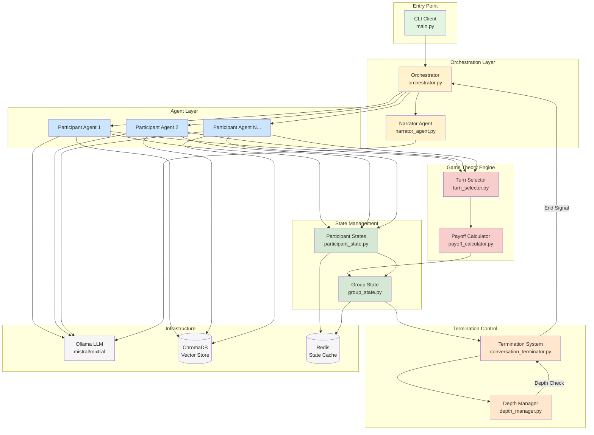
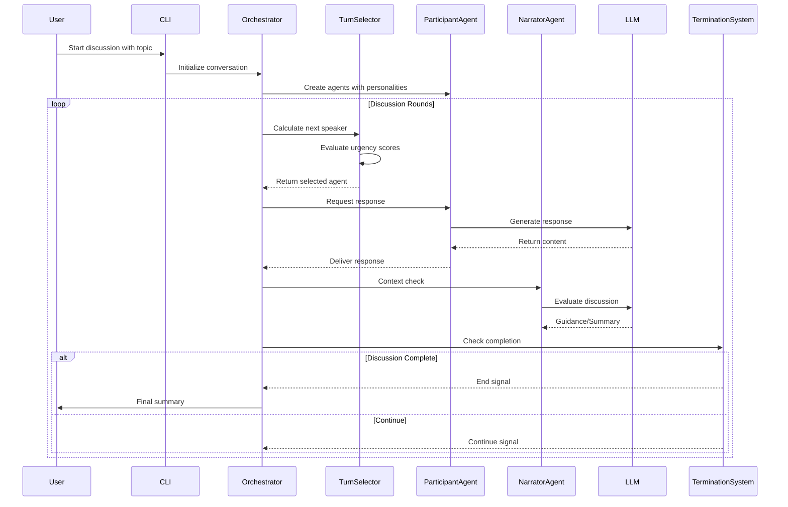
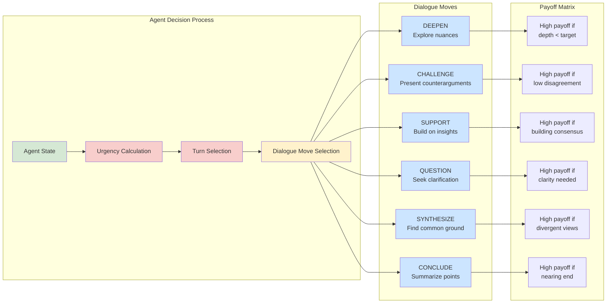

# AI Talks: Multi-Agent Philosophical Discussion System

An AI-powered system that orchestrates rich philosophical discussions using game theory and emergent social dynamics.

## Features

- **Game-Theoretic Turn-Taking**: Mathematical model determines who speaks next
- **Depth-Aware Exploration**: Configure conversation depth (1-5 levels)
- **Personality Diversity**: 6 distinct personality archetypes
- **Gender Representation**: Male, female, and non-binary participants
- **Emergent Dynamics**: Relationships and coalitions form naturally
- **Smart Termination**: Multi-criteria conversation completion

## Quick Start

### Prerequisites

- Python 3.8+
- Docker and Docker Compose (for Ollama LLM)
- NVIDIA GPU (optional, for GPU acceleration)

### Installation

```bash
# Clone repository
git clone https://github.com/yourusername/talks.git
cd talks

# Create virtual environment (recommended)
python -m venv venv
source venv/bin/activate  # On Windows: venv\Scripts\activate

# Install dependencies
pip install -r requirements.txt

# Create .env file from example (configure your API keys)
cp .env.example .env

# Start infrastructure (Ollama, ChromaDB, Redis)
docker-compose up -d

# Pull LLM model
docker exec talks-ollama ollama pull mistral
```

### Basic Usage

```bash
# Simple 2-person dialogue
python main.py --topic "What is consciousness?" --depth 3 --participants 2

# Read topic from file (useful for long questions)
python main.py --file question.txt --depth 4 --participants 3

# Use config file
python main.py --config configs/academic_panel.yaml

# Deep philosophical exploration
python main.py --topic "Ethics of AI" --depth 5 --participants 4 --max-turns 40

# Use pre-configured panels
python main.py --panel philosophy --topic "Free will vs determinism"
```

### Using File Input for Complex Topics

When you have a long or complex topic that may exceed command line length limits, you can save it to a file and use the `-f` or `--file` option:

```bash
# Create a file with your question
echo "At the point of creation was the universe in a state of quantum superposition, and if so, what caused the collapse of the wave function if there were no observers?" > question.txt

# Run the discussion using the file
python main.py -f question.txt --depth 5 --participants 4
```

## Configuration

Create YAML configs to customize participants:

```yaml
topic: "Your question here"
depth: 3

participants:
  - name: Sophia
    gender: female
    personality: collaborative
    expertise: ethics
```

### Personality Types

- **Analytical**: Methodical, asks probing questions
- **Collaborative**: Seeks consensus, builds bridges
- **Assertive**: Confident, dominates discussion
- **Cautious**: Careful claims, hedges statements
- **Creative**: Novel perspectives, metaphorical
- **Skeptical**: Challenges assumptions, devil's advocate

## Architecture

The system uses a sophisticated game-theoretic approach to orchestrate multi-agent discussions:

### System Architecture Diagram



### Data Flow Diagram



### Core Components

1. **ParticipantState** (`src/states/participant_state.py`): Tracks individual agent states including personality, expertise, relationships, and conversation metrics
2. **GroupDiscussionState** (`src/states/group_state.py`): Manages global discussion state, tracking progress, convergence, and group dynamics
3. **TurnSelector** (`src/game_theory/turn_selector.py`): Uses game theory to determine speaking order based on urgency calculations
4. **PayoffCalculator** (`src/game_theory/payoff_calculator.py`): Evaluates utility of different dialogue moves (DEEPEN, CHALLENGE, SUPPORT, etc.)
5. **ParticipantAgent** (`src/agents/participant_agent.py`): Individual AI agents with distinct personalities and expertise
6. **NarratorAgent** (`src/agents/narrator_agent.py`): Manages conversation flow and provides contextual guidance
7. **Orchestrator** (`src/orchestration/orchestrator.py`): Manages the overall discussion flow and coordination
8. **TerminationSystem** (`src/termination/conversation_terminator.py`): Determines when discussions have reached natural conclusions
9. **DepthManager** (`src/termination/depth_manager.py`): Tracks and manages conversation depth progression

### Dialogue Moves and Game Theory



#### Available Dialogue Moves

- **DEEPEN**: Introduce more nuanced aspects
- **CHALLENGE**: Present counterarguments
- **SUPPORT**: Build on others' insights
- **QUESTION**: Seek clarification
- **SYNTHESIZE**: Find common ground
- **CONCLUDE**: Summarize and wrap up

## Development

### Running Tests

```bash
# Run all tests
pytest

# Run specific test module
pytest tests/test_game_theory.py

# Run with coverage
pytest --cov=src
```

### Code Quality

```bash
# Format code
black src/

# Lint
ruff check src/
```

## Examples

### Simple Discussion

```bash
python main.py --topic "What makes art meaningful?" --depth 2 --participants 2
```

### Academic Panel

```bash
python main.py --config configs/academic_panel.yaml
```

### Available Panels

Pre-configured expert panels are available:

- `philosophy`: Ethics, metaphysics, epistemology experts
- `science`: Physics, biology, chemistry specialists
- `technology`: AI, cybersecurity, blockchain experts
- `ai`: Machine learning, NLP, robotics specialists
- `popular_science`: Science communicators and educators

```bash
python main.py --panel technology --topic "Future of quantum computing"
```

### Custom Configuration

Create your own configuration file:

```yaml
topic: "Is free will an illusion?"
depth: 4

participants:
  - name: Dr Sarah Mitchell
    gender: female
    personality: analytical
    expertise: neuroscience
    
  - name: Prof Thomas Lee
    gender: male
    personality: skeptical
    expertise: philosophy
    
  - name: Dr Alex Rivera
    gender: non_binary
    personality: creative
    expertise: quantum_physics
```

## Depth Levels

1. **Surface (1)**: Basic exploration of the topic
2. **Principles (2)**: Underlying concepts and foundations
3. **Applications (3)**: Practical implications and examples
4. **Challenges (4)**: Edge cases and counterarguments
5. **Philosophy (5)**: Deep metaphysical and epistemological questions

## Troubleshooting

### Ollama Connection Issues

- Ensure Docker is running: `docker-compose ps`
- Check Ollama status: `docker logs talks-ollama`
- Verify port availability: `netstat -an | grep 11434`

### Model Not Found

- Pull the model: `docker exec talks-ollama ollama pull mistral`
- List available models: `docker exec talks-ollama ollama list`

### Python Import Errors

- Ensure virtual environment is activated: `source venv/bin/activate`
- Reinstall dependencies: `pip install -r requirements.txt`
- Check Python version: `python --version` (requires 3.8+)

### Slow Response Times

- Use smaller model: `mistral` instead of `mixtral`
- Reduce temperature in agent configuration
- Check system resources: `docker stats`

## Contributing

Contributions are welcome! Please feel free to submit a Pull Request.

## Project Structure

```bash
talks/
├── main.py                 # Entry point
├── src/
│   ├── agents/            # AI agent implementations
│   ├── cli/               # Command-line interface
│   ├── config/            # Configuration and panels
│   ├── game_theory/       # Turn selection and payoff calculations
│   ├── orchestration/     # Discussion orchestration
│   ├── states/            # State management
│   ├── termination/       # Conversation termination logic
│   └── utils/             # Utility functions
├── configs/               # Example configuration files
├── tests/                 # Test suite
└── outputs/               # Saved conversation logs
```

## Acknowledgments

- Built with LangChain and Ollama
- Uses ChromaDB for vector storage
- Redis for state management
- Rich for beautiful terminal output

---

## Next Steps

Future enhancements planned:

- Web API for programmatic access
- Real-time visualization of discussion dynamics
- Long-term memory across sessions
- Debate mode for competitive discussions
- Integration with more LLM providers

Enjoy watching AI agents engage in genuine philosophical discourse!
