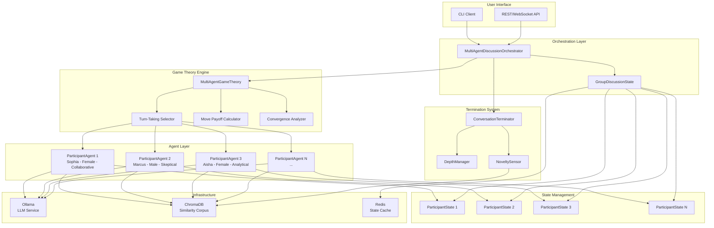
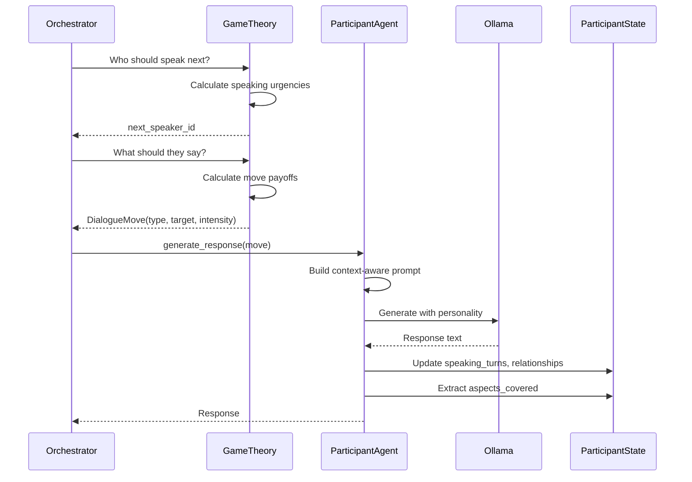
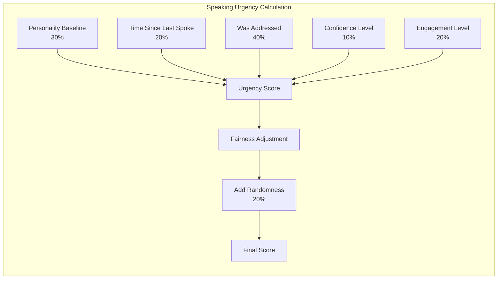
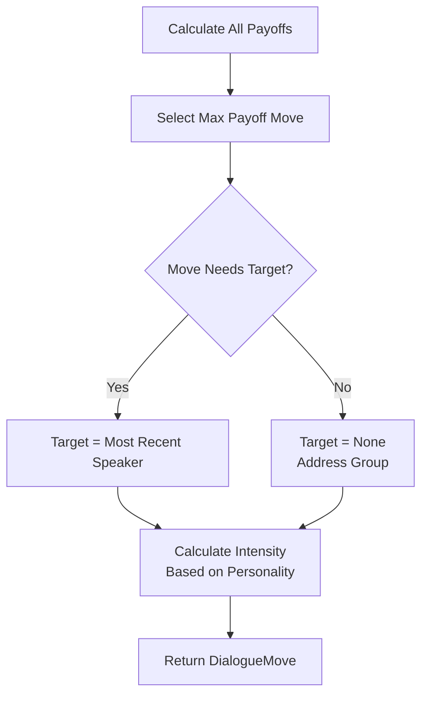
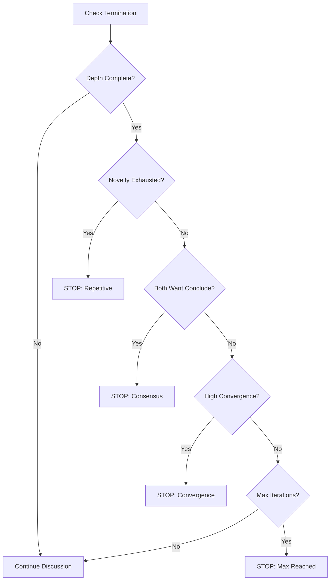

# Talks: Multi-Agent Philosophical Discussion System

## Design Document v1.0

**Project Vision**: Create an AI-powered system that orchestrates rich, multi-participant philosophical discussions using game theory, emergent social dynamics, and depth-aware conversation management.

---

## Table of Contents

1. [Executive Summary](#executive-summary)
2. [Core Concepts](#core-concepts)
3. [Architecture Overview](#architecture-overview)
4. [System Components](#system-components)
5. [Game Theory Engine](#game-theory-engine)
6. [State Management](#state-management)
7. [Termination Criteria](#termination-criteria)
8. [Technology Stack](#technology-stack)
9. [Implementation Phases](#implementation-phases)
10. [Usage Examples](#usage-examples)
11. [Future Enhancements](#future-enhancements)

---

## Executive Summary

**Talks** is a multi-agent discussion orchestration system that simulates natural philosophical dialogue between 2-N participants. Unlike simple chatbots, Talks uses **game theory** to determine:

- **Who speaks next** (turn-taking dynamics)
- **What they say** (dialogue moves based on strategic payoffs)
- **When to conclude** (multi-criteria termination)

### Key Innovations

1. **Game-Theoretic Turn-Taking**: Mathematical model determines speaker selection
2. **Depth-Aware Exploration**: Configurable depth levels (1-5) control conversation granularity
3. **Emergent Social Dynamics**: Relationships, coalitions, and dominance patterns emerge naturally
4. **Multi-Criteria Termination**: Combines depth coverage, novelty tracking, and convergence analysis
5. **Gender & Personality Diversity**: Each agent has distinct voice, personality archetype, and gender
6. **Scalable Architecture**: Works equally well for 2, 5, or 10+ participants

---

## Core Concepts

### 1. Philosophical Dialogue as a Cooperative Game

Unlike zero-sum games (one wins, one loses), philosophical discussions are **cooperative games** where all participants benefit from reaching deeper understanding. However, tension arises from:

- Different starting positions (optimist vs skeptic)
- Different expertise areas (ethics vs logic)
- Different personality types (assertive vs cautious)

This creates rich dynamics where participants must balance:
- **Individual conviction** vs **group consensus**
- **Challenging ideas** vs **building rapport**
- **Exploring depth** vs **concluding efficiently**

### 2. Depth Levels (Inspired by Musequill)

```
Depth 1: SURFACE
├─ High-level definitions
├─ Common understanding
└─ 2-4 exchanges

Depth 2: PRINCIPLES
├─ Underlying mechanisms
├─ Foundational concepts
└─ 6-8 exchanges

Depth 3: APPLICATIONS
├─ Real-world examples
├─ Practical implications
└─ 9-12 exchanges

Depth 4: CHALLENGES
├─ Counterarguments
├─ Edge cases
└─ 12-16 exchanges

Depth 5: PHILOSOPHY
├─ Broader frameworks
├─ Meta-level analysis
└─ 15-25 exchanges
```

### 3. Dialogue Moves (Game Theory Actions)

Each participant can execute one of six moves:

| Move           | Purpose                        | Example                                          |
| -------------- | ------------------------------ | ------------------------------------------------ |
| **DEEPEN**     | Push topic to next depth level | "But what defines 'purpose' in the first place?" |
| **CHALLENGE**  | Question another's claim       | "I disagree with your premise because..."        |
| **SUPPORT**    | Build on another's point       | "Exactly, and furthermore..."                    |
| **QUESTION**   | Seek clarification             | "Could you elaborate on what you mean by...?"    |
| **SYNTHESIZE** | Integrate viewpoints           | "Both perspectives reveal that..."               |
| **CONCLUDE**   | Signal readiness to finish     | "I think we've explored this thoroughly..."      |

### 4. Personality Archetypes

Each participant has one of six personalities (based on Big Five traits):

| Archetype         | Traits                    | Discussion Style                               |
| ----------------- | ------------------------- | ---------------------------------------------- |
| **ANALYTICAL**    | High openness, methodical | Asks probing questions, seeks precision        |
| **COLLABORATIVE** | High agreeableness        | Seeks consensus, builds bridges                |
| **ASSERTIVE**     | High extraversion         | Dominates discussion, confident claims         |
| **CAUTIOUS**      | High conscientiousness    | Careful claims, hedges statements              |
| **CREATIVE**      | High openness             | Novel perspectives, metaphorical thinking      |
| **SKEPTICAL**     | Low agreeableness         | Challenges assumptions, plays devil's advocate |

---

## Architecture Overview



---

## System Components

### 1. ParticipantState

**Purpose**: Tracks the dynamic state of each participant

**Data Structure**:
```python
@dataclass
class ParticipantState:
    # Identity
    participant_id: str
    name: str
    gender: Gender  # MALE, FEMALE, NON_BINARY
    personality: PersonalityArchetype
    expertise_area: str
    
    # Dynamic Discussion State
    confidence_level: float  # 0-1
    curiosity_level: float   # 0-1
    engagement_level: float  # 0-1
    
    # Social Dynamics
    relationships: Dict[str, float]  # participant_id -> affinity (-1 to 1)
    respect_levels: Dict[str, float]  # participant_id -> respect (0 to 1)
    
    # Conversation Tracking
    speaking_turns: int
    words_spoken: int
    questions_asked: int
    positions_taken: List[str]
    agreements_made: List[str]  # IDs of participants agreed with
    challenges_made: List[str]  # IDs of participants challenged
    
    # Topic Exploration
    depth_explored: int  # 1-5
    aspects_covered: Set[str]
    
    # Turn-Taking
    wants_to_speak: float  # 0-1: urgency
    last_spoke_turn: int
    was_addressed: bool
```

**Key Methods**:
- `update_relationship(other_id, delta)`: Adjust affinity with another participant
- `update_respect(other_id, delta)`: Adjust respect for another participant

---

### 2. GroupDiscussionState

**Purpose**: Global state for the entire discussion

**Data Structure**:
```python
@dataclass
class GroupDiscussionState:
    # Topic
    topic: str
    target_depth: int
    
    # Participants
    participants: Dict[str, ParticipantState]
    participant_order: List[str]
    
    # Progress
    turn_number: int
    exchanges: List[Dict]
    
    # Depth Tracking
    aspects_explored: Set[str]
    max_depth_reached: int
    
    # Group Dynamics
    dominant_speaker: Optional[str]
    coalitions: List[Set[str]]
    active_disagreement: bool
    
    # Termination
    convergence_level: float  # 0-1
    novelty_score: float      # 0-1
```

**Key Methods**:
- `get_participant(id)`: Retrieve participant state
- `get_other_participants(id)`: Get all except specified ID
- `get_recent_speakers(n)`: Last N speakers

---

### 3. ParticipantAgent

**Purpose**: Individual agent that generates responses

**Responsibilities**:
1. Generate dialogue using LLM
2. Update own state after speaking
3. Maintain character consistency (personality, gender, expertise)
4. Track relationships with other participants

**Key Methods**:
```python
async def generate_response(
    topic: str,
    group_state: GroupDiscussionState,
    recommended_move: DialogueMove
) -> str
```

**Response Generation Flow**:


---

## Game Theory Engine

### Turn-Taking Algorithm

**Goal**: Select next speaker using multi-factor scoring

**Factors**:



**Formula**:
```
urgency = personality_baseline * 0.3
        + time_factor * 0.2
        + addressed_bonus * 0.4
        + confidence * 0.1
        + engagement * 0.2

# Fairness adjustments
if is_dominant_speaker:
    urgency *= 0.7
if below_avg_turns:
    urgency *= 1.3

# Randomness (simulate natural unpredictability)
final_score = urgency * 0.8 + random(0, 0.2)
```

**Result**: Speaker with highest final_score is selected

---

### Move Payoff Calculation

**Goal**: For the selected speaker, determine best dialogue move

**Payoff Matrix**:

| Move           | Factors                                        | Payoff Formula                                                                                         |
| -------------- | ---------------------------------------------- | ------------------------------------------------------------------------------------------------------ |
| **DEEPEN**     | depth_gap, curiosity, recent_deepening         | `depth_gap * 0.3 + curiosity * 0.4 + novelty_bonus * 0.3`                                              |
| **CHALLENGE**  | personality, last_confidence, relationship     | `skeptical_bonus * 0.3 + target_confidence * 0.3 + negative_relationship * 0.2 + own_confidence * 0.2` |
| **SUPPORT**    | personality, relationship, respect             | `collaborative_bonus * 0.3 + positive_relationship * 0.4 + respect * 0.3`                              |
| **QUESTION**   | personality, curiosity, questions_asked        | `analytical_bonus * 0.4 + curiosity * 0.3 + (1 - saturation) * 0.3`                                    |
| **SYNTHESIZE** | recent_perspectives, disagreement, personality | `creative_bonus * 0.3 + num_perspectives * 0.3 + sweet_spot_disagreement * 0.4`                        |
| **CONCLUDE**   | depth_reached, aspects_covered, novelty        | `depth_complete * 0.4 + aspects_sufficient * 0.3 + low_novelty * 0.3`                                  |

**Decision Process**:


---

### Convergence Analysis

**Purpose**: Measure how much the group is converging toward consensus

**Metrics**:

1. **Agreement Ratio**: Support moves / (Support + Challenge moves)
2. **Relationship Positivity**: Average of positive relationships
3. **Position Similarity**: Semantic similarity of positions_taken (using embeddings)

**Formula**:
```
convergence = agreement_ratio * 0.6
            + avg_positive_relationships * 0.4
```

**Usage**: Helps determine when discussion is concluding naturally

---

## Termination Criteria

**Problem**: When should the discussion end?

**Solution**: Multi-criteria evaluation (ALL must pass OR reach max iterations)



### Criterion 1: Depth Exploration Complete

```python
def is_depth_explored(aspects_covered, exchange_count, target_depth):
    min_aspects = {1: 2, 2: 3, 3: 4, 4: 4, 5: 5}[target_depth]
    min_exchanges = target_depth * 3
    
    return (
        len(aspects_covered) >= min_aspects and
        exchange_count >= min_exchanges
    )
```

### Criterion 2: Novelty Exhaustion

Uses similarity corpus to detect when recent exchanges are too similar to previous ones:

```python
async def calculate_novelty(recent_exchanges):
    latest = recent_exchanges[-1]
    previous = "\n".join(recent_exchanges[:-1])
    
    # Search similarity corpus
    similar_matches = await corpus.search_similar(latest)
    max_similarity = max(match.score for match in similar_matches)
    
    novelty = 1.0 - max_similarity
    
    if novelty < 0.3:  # Less than 30% new content
        return "STOP: Going in circles"
```

### Criterion 3: Game Theory Consensus

```python
def check_game_theory_consensus(all_participants, group_state):
    conclude_votes = sum(
        1 for p in all_participants
        if calculate_move_payoffs(p)["CONCLUDE"] > 0.7
    )
    
    threshold = len(all_participants) * 0.7  # 70% must want to conclude
    
    return conclude_votes >= threshold
```

### Criterion 4: High Convergence

```python
def check_convergence(group_state, exchange_count, target_depth):
    min_exchanges = target_depth * 3
    
    return (
        group_state.convergence_level > 0.8 and
        exchange_count > min_exchanges
    )
```

---

## State Management

### Redis Usage

**Purpose**: Fast access to recent conversation context

**Schema**:
```
talks:session:{session_id}:state              → GroupDiscussionState (JSON)
talks:session:{session_id}:participant:{id}   → ParticipantState (JSON)
talks:session:{session_id}:exchanges          → List[Exchange] (JSON)
```

**TTL**: 24 hours

---

### ChromaDB Usage

**Purpose**: 
1. Similarity detection (prevent repetition)
2. Semantic search for past positions

**Collections**:

```python
# Main corpus: all utterances
collection_name = f"talks_{session_id}_corpus"

# Store each exchange
{
    "id": f"{participant_id}_turn_{turn_number}",
    "content": utterance_text,
    "metadata": {
        "speaker": participant_id,
        "turn": turn_number,
        "move": move_type,
        "target": target_id,
        "depth": depth_level
    }
}
```

---

## Technology Stack

### Core Infrastructure

```yaml
Language: Python 3.11+

LLM Service:
  - Ollama (local)
  - Model: gpt-oss:120b or equivalent
  - Temperature: 0.8-0.9 (higher for natural variation)

Vector Database:
  - ChromaDB 0.4+
  - For similarity detection and semantic search

State Cache:
  - Redis 7+
  - For fast state access

Orchestration:
  - LangGraph (StateGraph)
  - Async/await patterns

Web Framework:
  - FastAPI (REST + WebSocket)
  - For real-time streaming
```

### Key Dependencies

```python
# pyproject.toml
[tool.poetry.dependencies]
python = "^3.11"
langchain = "^0.1.0"
langchain-ollama = "^0.1.0"
langgraph = "^0.0.20"
chromadb = "^0.4.0"
redis = "^5.0.0"
fastapi = "^0.109.0"
uvicorn = "^0.27.0"
pydantic = "^2.5.0"
numpy = "^1.26.0"

[tool.poetry.group.dev.dependencies]
pytest = "^7.4.0"
pytest-asyncio = "^0.21.0"
```

---

## Implementation Phases

### Phase 1: Foundation (Week 1)

**Goal**: Basic 2-person dialogue working

**Deliverables**:
- [x] Project structure
- [x] ParticipantState dataclass
- [x] GroupDiscussionState dataclass
- [x] BasicGameTheory (simplified, 2-person only)
- [x] ParticipantAgent (basic prompt generation)
- [x] SimpleOrchestrator (2 agents, round-robin)
- [x] CLI interface

**Success Criteria**: 
```bash
python talks.py "What is consciousness?" --depth 2 --participants 2
# Outputs 6-8 exchanges alternating between Sophia and Marcus
```

---

### Phase 2: Game Theory (Week 2)

**Goal**: Implement full game-theoretic turn-taking

**Deliverables**:
- [x] MultiAgentGameTheory class
- [x] calculate_speaking_urgency()
- [x] select_next_speaker()
- [x] calculate_move_payoffs()
- [x] recommend_move_and_target()

**Success Criteria**:
- Non-deterministic turn order
- Participants who are addressed speak next with high probability
- Dominant speakers get throttled
- Correct moves selected based on context

---

### Phase 3: Termination Intelligence (Week 3)

**Goal**: Smart conversation ending

**Deliverables**:
- [x] ConversationTerminator class
- [x] DepthManager
- [x] NoveltySensor (with ChromaDB integration)
- [x] Multi-criteria termination logic

**Success Criteria**:
```bash
# Depth 1: Stops after ~4 exchanges
python talks.py "What is love?" --depth 1

# Depth 5: Runs 15-25 exchanges
python talks.py "What is love?" --depth 5
```

---

### Phase 4: Multi-Agent Scale (Week 4)

**Goal**: Support 3-10 participants

**Deliverables**:
- [x] Dynamic participant loading from config
- [x] Coalition detection
- [x] Relationship matrix visualization
- [x] Group convergence metrics

**Success Criteria**:
```bash
python talks.py "Ethics of AI" --depth 3 --participants 5
# 5 distinct voices, emergent alliances, fair turn distribution
```

---

### Phase 5: Character Richness (Week 5)

**Goal**: Gender-aware, personality-rich agents

**Deliverables**:
- [x] Gender-specific pronoun handling
- [x] Personality-driven language styles
- [x] Expertise-area knowledge injection
- [x] Voice consistency metrics

**Example**:
```
Sophia (female, collaborative, ethics):
"I think we can find common ground here. What if we consider..."

Marcus (male, skeptical, logic):
"I'm not convinced by that argument. The premise assumes..."

Aisha (female, analytical, science):
"Let me clarify the empirical evidence. Studies show..."
```

---

### Phase 6: Production Ready (Week 6)

**Goal**: API, monitoring, deployment

**Deliverables**:
- [x] REST API endpoints
- [x] WebSocket streaming
- [x] Logging and metrics
- [x] Docker compose setup
- [x] Documentation

---

## Usage Examples

### Example 1: Simple 2-Person Dialogue

```bash
python talks.py \
  --topic "What is the meaning of life?" \
  --depth 3 \
  --participants 2
```

**Expected Output**:
```
🎭 Talks: Multi-Agent Discussion System
Topic: What is the meaning of life?
Depth: 3 (Applications)
Participants: 2

--- Turn 1: Sophia (collaborative) ---
Move: DEEPEN
Life's meaning might lie in our connections with others and the 
positive impact we create. But what constitutes a meaningful 
connection?

--- Turn 2: Marcus (skeptical) ---
Move: CHALLENGE → Sophia
I'd challenge that. Connection alone doesn't guarantee meaning - 
we can connect over destructive things. Perhaps meaning is entirely 
subjective?

--- Turn 3: Sophia (collaborative) ---
Move: SUPPORT → Marcus
You're right that not all connections create meaning. Maybe meaning 
emerges when our connections align with our personal values?

...

--- Turn 9: Marcus (skeptical) ---
Move: CONCLUDE
I think we've thoroughly explored this. We've covered objective vs 
subjective meaning, the role of connection, and practical examples. 
A satisfying depth for this question.

✅ Discussion Complete: Group consensus to conclude
📊 Summary: 9 exchanges, 4 aspects explored, convergence: 0.82
```

---

### Example 2: Multi-Participant Deep Dive

```bash
python talks.py \
  --topic "Should AI systems have rights?" \
  --depth 5 \
  --participants 4 \
  --config configs/ai_ethics_panel.yaml
```

**configs/ai_ethics_panel.yaml**:
```yaml
participants:
  - name: Sophia
    gender: female
    personality: collaborative
    expertise: ethics
    
  - name: Marcus
    gender: male
    personality: skeptical
    expertise: philosophy
    
  - name: Aisha
    gender: female
    personality: analytical
    expertise: computer_science
    
  - name: James
    gender: male
    personality: creative
    expertise: law
```

---

### Example 3: API Usage

```python
import asyncio
from talks import MultiAgentDiscussionOrchestrator

async def main():
    config = [
        {"name": "Sophia", "gender": "female", "personality": "collaborative", "expertise": "ethics"},
        {"name": "Marcus", "gender": "male", "personality": "skeptical", "expertise": "logic"}
    ]
    
    orchestrator = MultiAgentDiscussionOrchestrator(
        topic="What is consciousness?",
        target_depth=3,
        participants_config=config
    )
    
    exchanges = await orchestrator.run_discussion()
    
    for exchange in exchanges:
        print(f"{exchange['speaker']}: {exchange['content']}")

asyncio.run(main())
```

---

## Future Enhancements

### Phase 7: Advanced Features

**Debate Modes**:
- Competitive debates (adversarial, not cooperative)
- Formal debate structure (opening statements, rebuttals, closing)
- Judged debates with scoring

**Learning & Adaptation**:
- Participants learn from past discussions
- Evolving personalities based on interaction history
- Long-term memory across sessions

**Creative Writing Integration**:
- Character development through dialogue
- Plot-driven conversations (not just abstract topics)
- Narrator agent for storytelling
- Scene-based dialogue generation

**Advanced Game Theory**:
- Coalition formation detection
- Strategic lying/bluffing (for creative scenarios)
- Negotiation and bargaining protocols

**Rich Outputs**:
- Conversation visualization (network graphs)
- Relationship evolution charts
- Topic map generation
- Video/audio synthesis of conversations

---

## Appendix A: Prompt Engineering Patterns

### Base Participant Prompt Template

```python
PARTICIPANT_PROMPT = """
You are {name}, a {personality} thinker with expertise in {expertise}.
You use {pronouns} pronouns.

DISCUSSION TOPIC: {topic}
TARGET DEPTH: Level {depth}/5

OTHER PARTICIPANTS:
{other_participants}

YOUR RELATIONSHIPS:
{relationships}

RECENT EXCHANGES:
{recent_exchanges}

YOUR TASK: {move_instruction}

Guidelines:
- Stay true to your {personality} personality
- Keep response to 2-4 sentences
- If addressing someone, use their name
- Maintain perspective from your {expertise} expertise
- Be natural, not expository

Respond as {name} would in this discussion.
"""
```

---

## Appendix B: Metrics & Evaluation

### Discussion Quality Metrics

1. **Turn Distribution Fairness**: Gini coefficient of speaking turns
2. **Depth Achievement**: `max_depth_reached / target_depth`
3. **Aspect Coverage**: `len(aspects_explored) / (target_depth * 3)`
4. **Novelty Maintenance**: Average novelty score across all turns
5. **Convergence Rate**: Change in convergence_level over time
6. **Personality Consistency**: Embedding similarity of utterances to personality profile

### Example Evaluation Report

```
📊 Discussion Evaluation Report
━━━━━━━━━━━━━━━━━━━━━━━━━━━━━━━━

Topic: What is consciousness?
Duration: 12 exchanges
Participants: 4

Turn Distribution:
  Sophia:  3 turns (25%) ████████
  Marcus:  4 turns (33%) ███████████
  Aisha:   3 turns (25%) ████████
  James:   2 turns (17%) █████

Depth Achievement: 100% (reached 3/3)
Aspect Coverage: 117% (7 aspects / 6 required)
Novelty Score: 0.67 (good variation)
Final Convergence: 0.79 (high agreement)

Relationship Matrix:
         Sophia  Marcus  Aisha  James
Sophia    -      +0.4    +0.5   +0.2
Marcus   +0.4     -      -0.1   +0.3
Aisha    +0.5    -0.1     -     +0.4
James    +0.2    +0.3    +0.4    -

Quality Score: 87/100 ⭐⭐⭐⭐
```

---

## Appendix C: Configuration Examples

### Simple Config (2 philosophers)

```yaml
# configs/simple.yaml
topic: "What is the meaning of life?"
depth: 2
participants:
  - name: Sophia
    gender: female
    personality: collaborative
    expertise: existentialism
    
  - name: Marcus
    gender: male
    personality: skeptical
    expertise: logic
```

### Complex Config (Academic Panel)

```yaml
# configs/academic_panel.yaml
topic: "The future of human-AI collaboration"
depth: 4
max_iterations: 30

participants:
  - name: Dr. Elena Rodriguez
    gender: female
    personality: analytical
    expertise: cognitive_science
    core_beliefs:
      - "Intelligence is computational"
      - "Consciousness requires embodiment"
    
  - name: Prof. James Chen
    gender: male
    personality: assertive
    expertise: machine_learning
    core_beliefs:
      - "AGI is achievable this century"
      - "Safety concerns are overblown"
    
  - name: Dr. Aisha Okonkwo
    gender: female
    personality: cautious
    expertise: AI_safety
    core_beliefs:
      - "Alignment is the key challenge"
      - "We must proceed carefully"
    
  - name: Dr. Marcus Williams
    gender: male
    personality: creative
    expertise: philosophy_of_mind
    core_beliefs:
      - "Meaning requires intentionality"
      - "AI cannot truly understand"

termination:
  min_novelty: 0.3
  min_convergence: 0.75
  depth_threshold: 0.8
```

---

## Summary

**Talks** represents a novel approach to AI-generated dialogue that goes beyond simple back-and-forth exchanges. By incorporating:

- **Game theory** for strategic decision-making
- **Personality archetypes** for rich character diversity
- **Depth-aware exploration** for controlled granularity
- **Multi-criteria termination** for natural conclusions
- **Emergent social dynamics** for realistic interactions

...we create discussions that feel authentic, intellectually rigorous, and genuinely interesting to read.

The system scales elegantly from 2 to N participants, making it suitable for:
- Philosophical dialogue generation
- Creative writing (character interactions)
- Educational content (multi-perspective exploration)
- Research (modeling group dynamics)

**Next Step**: Implementation begins! 🚀

---

**Document Version**: 1.0  
**Last Updated**: 2025-10-07  
**Authors**: Design Team  
**Status**: Ready for Implementation